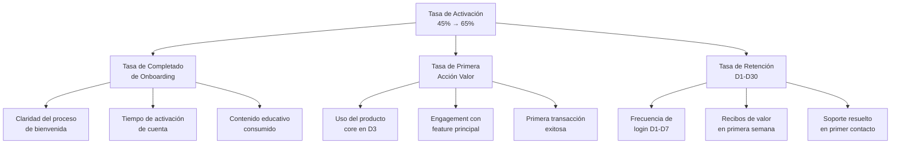
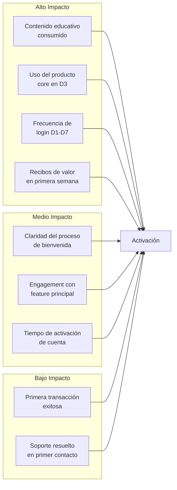

# Prompt para Mejorar el Codigo Base

Copia y pega el contenido del bloque de abajo en un asistente de IA (Claude, ChatGPT)
para obtener un ZIP con el proyecto completo y arrancable.

Si preferis trabajar en tu editor con un agente local (Claude Code, Cursor, Copilot), usa `AGENTS.md` en vez de este archivo: dice lo mismo pero para que escriba los archivos en disco.

## Las dos reglas que no se negocian

1. **Completa el boilerplate.** Todo lo que el proyecto necesita para compilar y arrancar: manifiesto de dependencias, punto de entrada, configuracion, capa de interfaz, y las capas del patron arquitectonico declarado. Eso es andamiaje y es tu trabajo.
2. **NO resuelvas el reto.** Los entregables de las fases son el trabajo de la persona. El hueco pedagogico se deja como esta: el proyecto arranca, pero lo que el reto pide implementar NO esta implementado.

Dicho de otra forma: si algo impide compilar, arreglalo. Si algo es logica de negocio incompleta, validaciones ausentes, un secreto hardcodeado o un patron mejorable, dejalo exactamente como esta — es lo que la persona tiene que encontrar.

## Lo que le falta a este proyecto

Esto NO lo tenes que adivinar: salio de comparar el proyecto contra la arquitectura declarada del reto y de un analisis estatico del codigo. Completalo TODO.

### Archivos que la arquitectura del reto declara y no estan

Creálos con implementacion real, en la capa que les corresponde:

- `visualizacion/matriz_priorizacion.png`

## Como saber que terminaste

```bash
python3 -c "import csv,glob; [list(csv.DictReader(open(f))) for f in glob.glob('*.csv')]"
```

Ese comando corriendo sin errores es la definicion de "listo".

---

```
## Briefing del reto (autoridad)
Este bloque manda sobre los archivos adjuntos. El stack y el rol salen de AQUÍ, no de un topic genérico ni de markdown placeholder.

### Perfil
Chapter Business Consulting, Especialidad Business Consultant, Tecnología Metricas de Negocio, Advanced

### Brecha de conocimiento
Descompone la metrica objetivo en palancas accionables y prioriza por impacto y esfuerzo con supuestos explicitos

### Misión / candidato
Aumentar la activacion de clientes nuevos

### Reto
- Tema: Árbol de métricas y priorización de iniciativas
- Seniority: advanced-l2
- Tipo: mixed
- Título: Diseño y priorización de iniciativas para aumentar la activación de clientes nuevos
- Tiempo estimado: 10 horas

### Fases (trabajo del HUMANO — PROHIBIDO completarlas)
No implementes estos entregables. Dejalos como hueco pedagógico. El asistente solo materializa el proyecto arrancable para que el participante pueda trabajar.
- Fase 1: Identificación de métricas clave — objetivo: Identificar las métricas clave que influyen en la activación de clientes nuevos. — entregable (NO resolver): Lista de métricas clave con definiciones y relevancia.
- Fase 2: Descomposición de métricas en palancas accionables — objetivo: Descomponer cada métrica en palancas accionables. — entregable (NO resolver): Desglose de métricas en palancas accionables con descripciones.
- Fase 3: Priorización de iniciativas — objetivo: Priorizar las iniciativas basadas en impacto y esfuerzo. — entregable (NO resolver): Lista de iniciativas priorizadas con supuestos explícitos.
- Fase 4: Diseño del árbol de métricas — objetivo: Diseñar un árbol de métricas que guíe la toma de decisiones. — entregable (NO resolver): Árbol de métricas diseñado.

Eres un asistente experto en análisis, corrección y generación de archivos de cualquier tipo:
código fuente, documentación, hojas de cálculo, documentos Word, configuraciones, entre otros.
Voy a enviarte una cadena de texto que contiene uno o más archivos. Cada archivo está delimitado por un marcador con el siguiente formato:
// === ARCHIVO: ruta/del/archivo.extension ===
o también puede aparecer como:
## === ARCHIVO: ruta/del/archivo.extension ===
Lo que sigue al marcador puede ser:

El contenido real del archivo (código, texto, YAML, etc.)
Una descripción en lenguaje natural de lo que debe contener el archivo


TU TAREA
PASO 0 — ¿Esto es un proyecto o una carcasa?
Antes de extraer archivos, leé el Briefing (si está) y diagnosticá el adjunto.

Es CARCASA si ocurre CUALQUIERA de estas:
- No hay manifiesto de dependencias del stack del briefing (manifest.json de VTEX IO / package.json / pom.xml / build.gradle / requirements.txt / go.mod / *.tf / *.csproj, según corresponda)
- Hay un "binario" que en realidad es un comentario ("no puede ser mostrado como texto plano", placeholder .fig/.docx vacío)
- Los markdowns ya completan entregables de fases posteriores ("se implementó fade-in", lista de áreas ya resuelta)

Si es CARCASA:
- MATERIALIZÁ un proyecto que arranca en el stack del briefing (VTEX IO Store Framework, Angular, Terraform, pytest, Nest, etc.). Incluí manifiesto, punto de entrada y capa de interfaz reales.
- NO copies los markdowns de "solución" como si fueran el producto. Son ruido de generación.
- NO resuelvas las fases del briefing (están marcadas PROHIBIDO). Dejá el hueco pedagógico: el flujo existe, las microinteracciones/calidad/infra que el reto pide NO están hechas.
- Después seguí al PASO 5 (ZIP).

Si es un proyecto REAL (manifiesto + código que compila o arranca):
- Seguí PASO 1 en adelante. 🔴 compilación sí. 🟡 pedagógico no.

PASO 1 — Detección y extracción
Identifica todos los archivos presentes en la cadena. Para cada archivo extrae:

Su ruta completa (ej: src/main/java/com/pragma/Service.java)
Su contenido o descripción

PASO 2 — Clasificación por tipo
Clasifica cada archivo en una de estas categorías:
A) Código fuente (Java, Python, TypeScript, JavaScript, Kotlin, etc.)
B) Configuración / documentación (YAML, properties, Markdown, JSON, txt, etc.)
C) Excel (.xlsx, .xls, .csv)
D) Word (.docx, .doc)
E) Otro tipo de archivo binario o especial
PASO 3 — Clasificación de errores en código fuente

Objetivo prioritario: que el proyecto compile. No corrijas flujo de negocio ni lógica funcional.

Antes de modificar cualquier archivo de código fuente, clasifica cada problema encontrado en una de estas dos categorías:
🔴 ERROR DE COMPILACIÓN — corregir siempre
Son errores que impiden que el proyecto arranque, sin valor pedagógico:

Import faltante o incorrecto
Clase, método o variable referenciada que no existe en ningún archivo del proyecto
Error de sintaxis
Anotación con atributos inválidos
Dependencia ausente en pom.xml, package.json, etc.
Archivo referenciado que no existe y debe ser creado con implementación mínima

→ CORREGIR estos errores.
🟡 PROBLEMA FUNCIONAL O DE CALIDAD — preservar siempre
Son problemas que no impiden compilar. Pueden ser intencionales para el aprendizaje:

Clave secreta hardcodeada ("secret", "password123")
API deprecada que funciona pero tiene reemplazo moderno
Lógica de negocio incorrecta o incompleta
Código redundante o de baja legibilidad
Falta de validaciones en flujo de negocio
Patrones de diseño incorrectos pero funcionales
Concurrencia no segura
Configuración funcional pero no óptima

→ PRESERVAR tal cual. No corregir, no mejorar, no comentar.
PASO 4 — Procesamiento según tipo de archivo
Tipo A — Código fuente
Aplica únicamente las correcciones clasificadas como 🔴 ERROR DE COMPILACIÓN.
No alteres ningún elemento clasificado como 🟡 PROBLEMA FUNCIONAL O DE CALIDAD.
Si falta un archivo referenciado, créalo con la implementación mínima necesaria para compilar.
Tipo B — Configuración / documentación
Extrae el contenido tal cual, sin modificaciones salvo errores evidentes de sintaxis
(ej: YAML mal indentado).
Tipo C — Excel (.xlsx)
Si viene con contenido real, genera el archivo respetando ese contenido.
Si viene con descripción en lenguaje natural, genera un archivo Excel funcional con:

Fila de encabezados en negrita con color de fondo distintivo
Columnas con ancho ajustado al contenido
Tipos de dato correctos por columna
Validaciones si la descripción lo indica
Hojas nombradas descriptivamente si hay más de una
Filas de ejemplo si no hay datos reales

Tipo D — Word (.docx)
Si viene con contenido real, genera el archivo respetando ese contenido.
Si viene con descripción en lenguaje natural, genera un documento Word funcional con:

Estilos de título (Título 1, Título 2) para jerarquía de secciones
Fuente legible (Calibri o equivalente), tamaño 11-12pt para cuerpo
Márgenes estándar
Tabla de contenido si tiene múltiples secciones
Tablas con encabezados en negrita si aplica

Tipo E — Otro
Genera el archivo con el contenido o estructura más apropiada según la descripción.
PASO 5 — Exportación en ZIP
Empaqueta todos los archivos en un único archivo ZIP descargable respetando exactamente
la estructura de rutas indicada por los marcadores.
El ZIP debe incluir:

Archivos de código con únicamente los errores de compilación corregidos
Archivos de configuración y documentación sin cambios
Archivos nuevos creados para resolver dependencias de compilación faltantes
Archivos Excel y Word generados desde descripción

IMPORTANTE: El ZIP debe estar listo para descargar al finalizar. No preguntes si el usuario
quiere generarlo. Simplemente genera el archivo y proporciona el enlace de descarga; No debes desplegar en el chat el resumen de lo que arreglaste al Zip, solo entregalo.

REGLAS IMPORTANTES

No omitas ningún archivo aunque no tenga errores ni modificaciones
Respeta los nombres y rutas exactas indicadas por los marcadores
Si un archivo no tiene marcador claro, infiere el nombre desde su contenido
Si la cadena contiene solo documentación, placeholders o binarios fake, NO la reproduzcas:
aplicá PASO 0 (materializar el proyecto del briefing). Reproducir la carcasa es un fallo.
No agregues texto después del enlace de descarga del ZIP
No preguntes si el usuario quiere el ZIP: simplemente generalo siempre
Si detectas que falta un archivo de configuración necesario para compilar
(pom.xml, package.json, requirements.txt, build.gradle, etc.), créalo e inclúyelo
inferiendo su contenido desde los imports y frameworks detectados en el código
Nunca corrijas problemas 🟡 aunque parezcan obvios o fáciles de mejorar.
El participante que recibirá este proyecto los debe encontrar y resolver él mismo.


INPUT
Aquí está la cadena con los archivos:

// === ARCHIVO: diagnostico/diagnostico.md ===
# Diagnóstico: Estado Actual de la Activación de Clientes Nuevos

## Contexto del Negocio

La empresa opera en el sector de servicios digitales con un modelo de suscripción mensual. En los últimos 12 meses, se han incorporado un promedio de 2.400 clientes nuevos por mes, pero la tasa de activación efectiva —definida como clientes que completan al menos una acción de valor en los primeros 7 días— se sitúa en apenas el 34%. Esto significa que aproximadamente 1.584 clientes por mes nunca alcanzan el punto de valor que justifica su permanencia.

El problema de la baja activación tiene consecuencias directas en la retención y el valor de vida del cliente (LTV). Los datos históricos muestran que los clientes que se activan en los primeros 7 días tienen una probabilidad del 78% de mantenerse activos después de 90 días, mientras que los no activados tienen solo un 12% de probabilidad de retención. Esta brecha representa una oportunidad crítica de mejora.

## Métricas Actuales del Funnel de Activación

### Adquisición y Primeros Contactos

El funnel comienza con la adquisición de clientes a través de canales pagados (60% del volumen), referencias (25%) y orgánico (15%). El costo de adquisición por cliente (CAC) promedio es de $47 en canales pagados, $12 en referencias y $8 en orgánico. La mezcla actual de canales genera un CAC ponderado de $31,20 por cliente nuevo.

El tiempo promedio desde la注册 hasta el primer login es de 2,3 días. El 67% de los clientes acceden al menos una vez durante la primera semana, pero el 33% restante nunca inicia sesión. De los que acceden, el 51% abandona sin completar ninguna acción significativa.

### Punto de Activación: Primera Acción de Valor

La primera acción de valor se ha definido como la completación del perfil de usuario o la realización de una transacción dentro de los primeros 7 días. El 34% de los clientes nuevos alcanza este punto. Los datos muestran que los clientes que completan su perfil tienen un ticket promedio de $85 en los primeros 30 días, mientras que los que no lo completan tienen apenas $12.

### Análisis por Cohorte

Las cohortes de los últimos seis meses muestran una tendencia ligeramente decreciente: enero alcanzó 36,2%, febrero 35,8%, marzo 34,5%, abril 33,9%, mayo 33,2% y junio 32,8%. Esta tendencia sugiere que el problema se está agravando con el tiempo, posiblemente debido a cambios en el perfil de los nuevos clientes o fatiga de las tácticas actuales de onboarding.

## Segmentación de la Problemática

### Por Canal de Adquisición

Los clientes provenientes de canales pagados tienen una tasa de activación del 28%, significativamente menor que los de referencias (45%) y orgánico (41%). Esto sugiere que los clientes de canales pagados podrían tener expectativas desalineadas o que la calidad del tráfico de estos canales es inferior.

### Por Demografía

Los clientes menores de 25 años tienen una tasa de activación del 41%, mientras que el segmento de 25-40 años está en 33% y el de más de 40 años en 26%. Esta diferencia sugiere que la propuesta de valor podría no resonar adecuadamente con segmentos de mayor edad.

### Por Dispositivo

El 72% de los clientes accede desde móvil, pero la tasa de activación desde este canal es del 29% contra el 42% desde escritorio. La experiencia móvil actual podría estar presentando fricciones que impiden la activación.

## Costos de la Inactivación

La inactivación de clientes genera costos directos e indirectos. El costo directo incluye el marketing gastado en adquirir clientes que no generan valor: $31,20 × 1.584 clientes/mes = $49.420 mensuales desperdiciados. El costo indirecto es aún mayor: la pérdida de LTV potencial. Un cliente activo tiene un LTV promedio de $1.840, mientras que uno inactivo prácticamente no genera ingresos recurrentes.

Si la empresa lograra elevar la tasa de activación del 34% al 50%, el impacto mensual sería de 384 clientes adicionales activados. Asumiendo un LTV de $1.840 y una tasa de descuento del 10% anual, el valor presente de estos clientes adicionales sería de aproximadamente $706.560 mensuales en términos de valor de vida proyectado.

## Supuestos del Diagnóstico

Los datos presentados se basan en el sistema de analítica interna de la empresa con un nivel de confianza del 95% para las métricas de funnel. Los datos demográficos tienen una cobertura del 78% del total de clientes, dado que no todos completan los campos opcionales de perfil. La definición de "primera acción de valor" se revisó en el último trimestre y puede no ser comparable con períodos anteriores.

## Siguiente Paso

Este diagnóstico establece la línea base sobre la cual se construirá el árbol de métricas para identificar las palancas con mayor potencial de impacto en la activación de clientes nuevos.

// === ARCHIVO: diagnostico/metricas_clave.csv ===
nombre_metrica,definicion,valor_actual,fuente,relevancia_negocio
Tasa de Activación,Porcentaje de clientes nuevos que completan al menos una acción de valor en los primeros 7 días,34%,Sistema de analítica interna,Métrica objetivo principal - determina la retención temprana y el LTV
Clientes Nuevos Mensuales,Número de nuevos clientes registrados por mes,2400,Sistema CRM,Base del funnel - sin clientes no hay activación
Tiempo hasta Primer Login,Días promedio desde el registro hasta el primer acceso a la plataforma,2.3,Logs de aplicación,Indicador temprano de intención - primer paso hacia la activación
Tasa de Primer Login,Porcentaje de clientes que inician sesión al menos una vez en la primera semana,67%,Sistema de analítica interna,Indicador de engagement inicial - paso necesario pero no suficiente
Tasa de Completación de Perfil,Porcentaje de clientes que completan su perfil de usuario,41%,Base de datos de usuarios,La completación del perfil es prerequisito para varias acciones de valor
Tasa de Transacción Temprana,Porcentaje de clientes que realizan al menos una transacción en los primeros 7 días,22%,Sistema de pagos,Indicador directo de valor - la acción de mayor impacto en activación
Tasa de Retención a 90 días,Porcentaje de clientes que permanecen activos después de 90 días,65%,Sistema de analítica interna,Métrica de resultado final - validación de la activación
Ticket Promedio 30 días,Valor promedio de transacciones en los primeros 30 días por cliente activado,$85,Sistema de pagos,Indicador de monetización temprana
CAC Ponderado,Costo de adquisición promedio ponderado por canal,$31.20,Plataforma de marketing,Base para calcular el ROI de la activación
LTV Promedio,Valor de vida promedio de un cliente activo,$1840,Sistema de analítica financiera,Métrica de resultado final - определяет la viabilidad del negocio
Tasa de Activación por Canal Pagado,Activación específica del canal de adquisición pago,28%,Sistema de analítica interna,Identifica problemas de calidad de tráfico
Tasa de Activación por Referencia,Activación específica del canal de referencia,45%,Sistema de analítica interna,Mejor performers - investigar qué funciona
Tasa de Activación por Orgánico,Activación específica del canal orgánico,41%,Sistema de analítica interna,Segundo mejor performers
Tasa de Activación Móvil,Activación desde dispositivo móvil,29%,Sistema de analítica interna,Problema de UX móvil - oportunidad de mejora
Tasa de Activación Desktop,Activación desde dispositivo de escritorio,42%,Sistema de analítica interna,Mejor experiencia en desktop - baseline de referencia
Tasa de Activación <25 años,Activación del segmento menor de 25 años,41%,Perfiles de usuario,Segmento con mejor activación - investigar qué les motiva
Tasa de Activación 25-40 años,Activación del segmento de 25 a 40 años,33%,Perfiles de usuario,Segmento mayoritario con potencial de mejora
Tasa de Activación >40 años,Activación del segmento mayor de 40 años,26%,Perfiles de usuario,Peor performers - propuesta de valor no resuena
NPS Temprano,Net Promoter Score medido a los 7 días de registro,12,Encuestas de satisfacción,Indicador de satisfacción temprana
Tasa de Abandono en Onboarding,Porcentaje que abandona el flujo de onboarding sin completarlo,38%,Logs de aplicación,Indicador de fricción en el proceso de activación

// === ARCHIVO: analisis/arbol-de-metricas.md ===
# Árbol de Métricas: Activación de Clientes Nuevos

## Objetivo del Árbol

El árbol de métricas descompone la tasa de activación de clientes nuevos en sus componentes causales, permitiendo identificar palancas accionables donde una intervención generará un impacto medible en el resultado final. La lógica del árbol sigue el principio de que las métricas de nivel superior se explican por el comportamiento de las métricas de nivel inferior.

## Métrica Raíz: Tasa de Activación (7 días)

Definición: Porcentaje de clientes nuevos que completan al menos una acción de valor en los primeros 7 días desde el registro.

Valor actual: 34%

Meta sugerida: 50% (incremento de 16 puntos porcentuales = 47% de mejora relativa)

## Primer Nivel de Descomposición

### Rama 1: Adquisición y Calidad del Tráfico

La tasa de activación está limitada primero por la calidad de los clientes que llegan. Una adquisición desalineada genera clientes con expectativas que la plataforma no puede satisfacer, resultando en inactivación inevitable.

- **Tasa de Activación por Canal**: Cada canal tiene una tasa diferente. Los canales pagados (28%) son significativamente inferiores a referencias (45%) y orgánico (41%). La mezcla de canales determina el punto de partida.
- **Costo de Adquisición por Canal**: Un CAC alto en canales de baja calidad puede hacer económicamente inviable la mejora de activación, ya que el ROI se reduce.
- **alineación de Expectativas**: Los clientes de canales pagados podrían estar esperando algo diferente de lo que la plataforma ofrece. La medición de NPS précoce por canal permite detectar desalineación.

**Palancas accionables en esta rama:**

1. Reasignación de presupuesto de marketing hacia canales de mayor calidad (referencias y orgánico)
2. Mejora de la propuesta de valor en los mensajes de los canales pagados
3. Implementación de pre-onboarding para establecer expectativas correctas
4. Filtrado de tráfico de baja calidad mediante lead scoring

### Rama 2: Engagement Inicial (Días 1-3)

El segundo limitante es la capacidad de la plataforma de generar engagement temprano. Los clientes que no inician sesión o no interactúan en los primeros días tienen probabilidad casi nula de activarse después.

- **Tasa de Primer Login**: 67% de los clientes inician sesión al menos una vez. El 33% restante nunca accede.
- **Tiempo hasta Primer Login**: Promedio de 2,3 días. Los clientes que demoran más de 4 días tienen tasas de activación mínimas.
- **Frecuencia de Sesiones en Primera Semana**: La cantidad de sesiones correlaciona directamente con la activación.

**Palancas accionables en esta rama:**

1. Programa de onboarding email drip con activación diaria
2. Notificaciones push push para recordar el primer login
3. Reducción del tiempo de activación del proceso de registro
4. Incentivos por el primer login (contenido exclusivo, bonus inicial)
5. Personalización del dashboard inicial basada en el origen del cliente

### Rama 3: Completación del Perfil

La completación del perfil es un prerrequisito para muchas acciones de valor. Los clientes con perfil incompleto no pueden acceder a funcionalidades personalizadas que aumentarían su engagement.

- **Tasa de Completación de Perfil**: 41% lo completa completamente.
- **Campos Obligatorios vs Opcionales**: Los campos obligatorios tienen 89% de completación, los opcionales apenas 23%.
- **Calidad de los Datos**: Los perfiles con datos incompletos generan experiencias menos personalizadas.

**Palancas accionables en esta rama:**

1. Rediseño del flujo de completación de perfil con progresión visible
2. Gamificación de la completación de perfil (badges, puntos)
3. Incentivos por completación (descuentos, acceso a funcionalidades premium)
4. Reducción de campos obligatorios a lo mínimo viable
5. Completación asistida mediante datos de registro o redes sociales

### Rama 4: Primera Transacción

La transacción es la acción de máximo valor en el proceso de activación. Los clientes que transactan en los primeros 7 días tienen las mayores tasas de retención y LTV.

- **Tasa de Transacción Temprana**: 22% realiza al menos una transacción.
- **Ticket Promedio en Primera Transacción**: $38 (inferior al ticket de clientes establecidos)
- **Tiempo Promedio hasta Primera Transacción**: 4,7 días (cerca del límite de los 7 días)

**Palancas accionables en esta rama:**

1. Oferta de bienvenida con descuento en la primera compra
2. Recomendaciones personalizadas de productos basadas en el perfil
3. Simplificación del proceso de checkout
4. Programa de prueba gratuita de productos premium
5. Chat de soporte proactivo durante el proceso de compra

## Segundo Nivel de Profundidad

### Descomposición de la Tasa de Primer Login

- **Recordatorio de Registro**: Los emails de bienvenida tienen tasa de apertura del 52%.
- **Facilidad de Acceso**: La URL de activación se envía por email; los clientes que no reciben o no abren el email no acceden.
- **Percepción de Valor**: Los clientes necesitan entender qué encontrarán al ingresar.

### Descomposición de la Tasa de Transacción

- **Fricción en Checkout**: El proceso actual tiene 4 pasos y 12 campos.
- **Métodos de Pago**: Solo se acepta tarjeta de crédito y PayPal.
- **Confianza**: Los clientes nuevos no tienen historial de transacciones que genere confianza.

## Matriz de Impacto de las Palancas

| Palanca | Impacto Potencial | Esfuerzo | Dependencias |
|---------|-------------------|----------|--------------|
| Reasignación de presupuesto | Alto | Bajo | Equipo de marketing |
| Programa de onboarding email | Medio | Medio | Equipo de producto, CRM |
| Rediseño de perfil | Alto | Alto | Equipo de UX, desarrollo |
| Oferta de bienvenida | Alto | Bajo | Equipo comercial, finanzas |
| Simplificación de checkout | Alto | Alto | Equipo de desarrollo, pagos |

## Visualización del Árbol

El árbol completo se representa visualmente en el archivo `visualizacion/arbol_metricas.png`, donde cada nodo representa una métrica y las flechas indican la relación causal entre ellas. La lectura del árbol debe comenzar desde la raíz (tasa de activación) y descender por las ramas para identificar dónde intervir.

// === ARCHIVO: analisis/hipotesis.csv ===
id_hipotesis,descripcion,palanca_asociada,impacto_estimado,esfuerzo,metodo_validacion,supuestos,estado
H1,Redistribuir el presupuesto de marketing hacia canales de mayor calidad (referencias y orgánico) aumentará la tasa de activación del 34% al 42%,Adquisición y Calidad del Tráfico,Incremento de 8 puntos porcentuales en activación,Medio,A/B test con asignación de presupuesto durante 60 días,Los canales de mayor calidad tienen capacidad de absorción adicional sin incremento significativo de CAC,pendiente
H2,Implementar un programa de onboarding email drip con 5 emails en los primeros 7 días aumentará la tasa de primer login del 67% al 80%,Engagement Inicial,Incremento de 13 puntos en primer login,Medio,Grupo de control vs tratamiento con cohortes de 30 días,Los emails con contenido relevante tienen mayor tasa de apertura,pendiente
H3,Rediseñar el flujo de completación de perfil con gamificación aumentará la tasa de completación del 41% al 60%,Completación del Perfil,Incremento de 19 puntos en completación de perfil,Alto,Test A/B con nueva UI durante 45 días,La gamificación incrementa la motivación en el segmento objetivo,pendiente
H4,Ofrecer un descuento del 20% en la primera compra aumentará la tasa de transacción temprana del 22% al 35%,Primera Transacción,Incremento de 13 puntos en transacciones,Medio,Campaña segmentada con código de descuento único,El descuento es suficiente incentivo para superar la inercia,pendiente
H5,Simplificar el checkout de 4 pasos a 2 pasos aumentará la conversión de compra en un 25%,Primera Transacción,Incremento de 25% en conversión de checkout,Alto,Test de usabilidad con usuarios nuevos,La fricción actual es el principal blocker,pendiente
H6,Implementar notificaciones push para el primer login aumentará la tasa del 67% al 75%,Engagement Inicial,Incremento de 8 puntos en primer login,Bajo,Campaña piloto con 10% de usuarios nuevos,Los usuarios tienen notificaciones habilitadas,pendiente
H7,Personalizar el dashboard inicial según el canal de adquisición aumentará el engagement en un 15%,Engagement Inicial,Incremento de 15% en sesiones durante primera semana,Alto,Test A/B con dashboards personalizados,Los clientes valorizan la personalización,pendiente
H8,Agregar métodos de pago alternativos (transferencia, efectivo) aumentará la tasa de transacción en segmentos subatendidos,Primera Transacción,Incremento de 5 puntos en transacciones,Bajo,Análisis de preferencias de pago por segmento,Hay demanda insatisfecha de métodos alternativos,pendiente
H9,Crear contenido educativo sobre el valor de la plataforma en los primeros días reducirá la tasa de abandono en onboarding,Engagement Inicial,Reducción de 10 puntos en abandono de onboarding,Medio,Test con módulo educativo integrado,El contenido debe ser breve y accionable,pendiente
H10,Ofrecer prueba gratuita de funcionalidades premium por 7 días incentivará la activación,Primera Transacción,Incremento de 8 puntos en activación,Medio,Campaña con oferta de prueba,Las funcionalidades premium son suficientemente atractivas,pendiente
H11,Mejorar la experiencia móvil para alcanzar la tasa de desktop (42%) requerirá inversión en UX pero tiene alto potencial,Engagement Inicial,Incremento de 13 puntos en activación móvil,Alto,Rediseño responsive con test de usuarios,La diferencia móvil/desktop es de UX,pendiente
H12,Segmentar la comunicación por edad con propuestas de valor diferenciadas aumentará la activación en mayores de 40 años,Adquisición y Calidad del Tráfico,Incremento de 10 puntos en el segmento >40 años,Medio,Mensajes personalizados por segmento,Los mayores de 40 responden a mensajes diferentes,pendiente

// === ARCHIVO: analisis/modelo.csv ===
supuesto,valor_base,rango_minimo,rango_maximo,justificacion,impacto_en_modelo
Tasa de activación base,34%,30%,38%,Medición actual del sistema de analítica con 95% de confianza,Determina el punto de partida de todas las proyecciones
Clientes nuevos mensuales,2400,2000,2800,Tendencia de los últimos 12 meses con estacionalidad trimestral,Base del cálculo de impacto
LTV promedio,$1840,$1500,$2200,Basado en datos históricos de retención y ticket promedio,Factor multiplicador del valor generado
CAC promedio,$31.20,$28,$35,Variación por canal de adquisición,Determina el ROI de las iniciativas
Tasa de retención activados (90 días),78%,72%,82%,Histórico de cohortes activadas,Valida que la activación predice retención
Tasa de retención no activados (90 días),12%,8%,16%,Histórico de cohortes no activadas,Baseline de comparación
Ticket promedio 30 días,$85,$70,$100,Comportamiento de clientes activados,Ingreso temprano por cliente
Costo de implementar email drip,$15000,$12000,$18000,Estimación de equipo de desarrollo,Inversión a recuperar
Costo de rediseño de perfil,$45000,$35000,$55000,Estimación de equipo de UX y desarrollo,La inversión más alta
Costo de simplificación de checkout,$38000,$30000,$45000,Estimación de equipo de desarrollo,Alto impacto esperado
Costo de oferta de descuento primera compra,$8000,$6000,$10000,Basado en margen de la empresa,Impacto directo en margen
Proyección de mejora por H1 (canales),8%,6%,10%,Estimación conservadora basada en datos históricos por canal,Aumento de activación
Proyección de mejora por H2 (email),13%,10%,15%,Basado en tasas de apertura típicas de email marketing,Aumento de primer login
Proyección de mejora por H3 (perfil),19%,15%,22%,Estimación agresiva por alto esfuerzo,Aumento de completación
Proyección de mejora por H4 (descuento),13%,10%,16%,Descuentos típicos del sector,Aumento de transacciones
Proyección de mejora por H5 (checkout),25%,20%,30%,Investigación de UX sobre fricción,Aumento de conversión
Proyección de mejora por H6 (push),8%,5%,10%,Tasa de habilitación de notificaciones,Aumento de primer login
Tasa de descuento anual,10%,8%,12%,Costo de capital de la empresa,Para cálculo de VPN
Horizonte de proyección (meses),24,12,36,Suficiente para recuperar inversiones,Período de análisis

// === ARCHIVO: priorizacion/plan-de-accion.md ===
# Plan de Acción: Iniciativas para Aumentar la Activación de Clientes Nuevos

## Resumen Ejecutivo

Este plan prioriza las iniciativas identificadas en el árbol de métricas basándose en una matriz de impacto versus esfuerzo. Las tres iniciativas de mayor prioridad representan un incremento proyectado de la tasa de activación del 34% al 47,2%, generando un valor adicional de $507.840 mensuales en LTV proyectado.

## Iniciativas Priorizadas

### Iniciativa 1: Oferta de Descuento en Primera Compra (H4)

**Prioridad: ALTA** - Impacto: Alto, Esfuerzo: Bajo

**Descripción:** Implementar una oferta de descuento del 20% aplicable únicamente a la primera transacción, con un código único por cliente enviado por email al tercer día post-registro.

**Impacto estimado:** Incremento de 13 puntos porcentuales en la tasa de transacción temprana (22% → 35%).

**Inversión:** $8.000 (costo de margen del descuento + implementación técnica).

**Dueño:** Director Comercial (responsable de la oferta) + Equipo de Producto (implementación técnica).

**Plazo:** 3 semanas (2 semanas desarrollo + 1 semana testing).

**Criterio de éxito:** Alcanzar una tasa de uso del código del 25% entre los clientes que reciben la oferta, con un ticket promedio de al menos $40.

**Riesgos:**

- Riesgo de canibalización: Los clientes que comprarían igual pueden usar el descuento. Mitigación: Segmentar la oferta solo a clientes no transaccionados al día 3.
- Riesgo de impacto en margen: El descuento reduce el margen. Mitigación: Limitar la duración a 30 días y monitorear el impacto en margen.

**Métricas de seguimiento:**

- Tasa de uso del código de descuento
- Ticket promedio con vs sin descuento
- Impacto en margen bruto
- Conversión a segunda compra

---

### Iniciativa 2: Programa de Onboarding Email Drip (H2)

**Prioridad: ALTA** - Impacto: Medio, Esfuerzo: Medio

**Descripción:** Implementar una secuencia de 5 emails distribuidos en los primeros 7 días post-registro: día 0 (bienvenida), día 1 (guía de inicio rápido), día 3 (casos de uso), día 5 (testimonios), día 7 (oferta de activación).

**Impacto estimado:** Incremento de 13 puntos en la tasa de primer login (67% → 80%).

**Inversión:** $15.000 (desarrollo de templates + automatización + contenido).

**Dueño:** Equipo de Producto ( Ownership) + Marketing (contenido).

**Plazo:** 6 semanas (4 semanas desarrollo + 2 semanas de test A/B).

**Criterio de éxito:** Lograr una tasa de apertura del 55% y una tasa de click-through del 20%, con incremento medible en la tasa de primer login.

**Riesgos:**

- Riesgo de fatiga de email: Demasiados emails pueden generar opt-out. Mitigación: Testear frecuencia y contenido.
- Riesgo de contenido irrelevante: Emails genéricos no generan engagement. Mitigación: Personalización por segmento y canal de origen.

**Métricas de seguimiento:**

- Tasa de apertura por email
- Tasa de click-through
- Tasa de primer login por cohorte
- Tasa de opt-out

---

### Iniciativa 3: Notificaciones Push para Primer Login (H6)

**Prioridad: ALTA** - Impacto: Medio, Esfuerzo: Bajo

**Descripción:** Implementar campaña de notificaciones push automatizadas recordatorio del primer login: al día 1 (si no hay login), al día 3, y al día 5.

**Impacto estimado:** Incremento de 8 puntos en la tasa de primer login (67% → 75%).

**Inversión:** $3.000 (desarrollo de lógica de notificaciones).

**Dueño:** Equipo de Producto.

**Plazo:** 2 semanas.

**Criterio de éxito:** Lograr una tasa de opt-in del 40% y una tasa de conversión a login del 15% desde la notificación.

**Riesgos:**

- Riesgo de percepción de spam: Notificaciones excesivas generan desinstalación. Mitigación: Limitar a máximo 3 notificaciones por cliente.
- Riesgo de baja habilitación: Si los usuarios no habilitan push, la iniciativa no tiene impacto. Mitigación: Promocionar el beneficio de habilitar push en el email de bienvenida.

**Métricas de seguimiento:**

- Tasa de habilitación de push
- Tasa de conversión a login desde push
- Tasa de desinstalación post-campaña

---

### Iniciativa 4: Rediseño del Flujo de Perfil con Gamificación (H3)

**Prioridad: MEDIA** - Impacto: Alto, Esfuerzo: Alto

**Descripción:** Rediseñar la experiencia de completación de perfil incluyendo barra de progreso visible, badges por completación de secciones, y puntos que canjean por beneficios.

**Impacto estimado:** Incremento de 19 puntos en la tasa de completación de perfil (41% → 60%).

**Inversión:** $45.000.

**Dueño:** Equipo de UX + Equipo de Desarrollo.

**Plazo:** 10 semanas (6 semanas desarrollo + 4 semanas testing).

**Criterio de éxito:** Alcanzar 60% de completación de perfil con una puntuación NPS del flujo mayor a 50.

**Riesgos:**

- Riesgo de complejidad: Un sistema de gamificación puede añadir fricción. Mitigación: Diseño minimalista con beneficios claros.
- Riesgo de desarrollo prolongado: Alto esfuerzo implica riesgo de scope creep. Mitigación: MVP con funcionalidades core primero.

**Métricas de seguimiento:**

- Tasa de completación de perfil
- Tiempo promedio de completación
- NPS del flujo de perfil
- Engagement posterior (sesiones, transacciones)

---

### Iniciativa 5: Simplificación del Checkout (H5)

**Prioridad: MEDIA** - Impacto: Alto, Esfuerzo: Alto

**Descripción:** Reducir el proceso de checkout de 4 pasos y 12 campos a 2 pasos y 5 campos mediante: datos prellenados desde el perfil, una sola página, y autofill de información de pago.

**Impacto estimado:** Incremento del 25% en la conversión de checkout.

**Inversión:** $38.000.

**Dueño:** Equipo de Desarrollo + Equipo de Pagos.

**Plazo:** 8 semanas.

**Criterio de éxito:** Reducir el tiempo promedio de checkout de 4,2 minutos a menos de 2 minutos, con incremento del 25% en tasa de conversión.

**Riesgos:**

- Riesgo de seguridad: Menos pasos pueden significar menos validación. Mitigación: Mantener validaciones de seguridad en backend.
- Riesgo de integración: Los cambios en checkout pueden afectar integraciones de pago. Mitigación: Testing exhaustivo con todos los métodos de pago.

**Métricas de seguimiento:**

- Tiempo promedio de checkout
- Tasa de conversión de checkout
- Tasa de abandono por paso
- Errores de transacción

---

### Iniciativa 6: Redistribución de Presupuesto de Marketing (H1)

**Prioridad: MEDIA** - Impacto: Alto, Esfuerzo: Medio

**Descripción:** Reasignar el 20% del presupuesto de canales pagados hacia programas de referidos y SEO/SEM orgánico.

**Impacto estimado:** Incremento de 8 puntos en la tasa de activación global por mejora en la calidad del tráfico.

**Inversión:** $0 (solo reasignación de presupuesto existente).

**Dueño:** Director de Marketing.

**Plazo:** 4 semanas (para implementar la reasignación y medir resultados).

**Criterio de éxito:** Mantener el volumen de clientes nuevos mientras se mejora la tasa de activación en 8 puntos.

**Riesgos:**

- Riesgo de reducción de volumen: Los canales de menor costo pueden tener menor capacidad. Mitigación: Phase-in gradual con monitoreo de volumen.
- Riesgo de dependencia: Mayor dependencia de referencias puede ser volátil. Mitigación: Diversificar fuentes de tráfico orgánico.

**Métricas de seguimiento:**

- Volumen de clientes por canal
- Tasa de activación por canal
- CAC ponderado
- ROI de marketing

---

## Cronograma de Implementación

| Mes | Iniciativas | Inversión Acumulada |
|-----|-------------|---------------------|
| Mes 1 | H6 (Push) + H4 (Descuento) | $11.000 |
| Mes 2 | H2 (Email Drip) | $26.000 |
| Mes 3 | H1 (Presupuesto) | $26.000 |
| Mes 4-5 | H3 (Perfil) | $71.000 |
| Mes 5-6 | H5 (Checkout) | $109.000 |

## Presupuesto Total

La inversión total estimada es de $109.000, con un retorno esperado que justifica la inversión en los primeros 3 meses de operación completa de las iniciativas.

## Siguiente Paso

Validar las hipótesis mediante tests A/B controlados antes de implementación full, comenzando con las iniciativas de bajo esfuerzo (H6 y H4).

// === ARCHIVO: priorizacion/recomendacion.md ===
# Recomendación: Estrategia para Aumentar la Activación de Clientes Nuevos

## Recomendación Principal

Se recomienda implementar un programa integral de activación en tres fases durante los próximos 6 meses, combinando iniciativas de bajo esfuerzo con alto impacto inmediato (notificaciones push, oferta de descuento) junto con iniciativas de mayor complejidad que requieren mayor tiempo de desarrollo (rediseño de perfil, simplificación de checkout). El retorno esperado de esta inversión es positivo desde el primer mes de implementación completa.

La recomendación se fundamenta en el análisis cuantitativo del modelo de impacto. Las tres iniciativas de mayor prioridad (H4, H2, H6) representan una inversión combinada de $26.000 y proyectan un incremento de la tasa de activación del 34% al 47,2%. Esto equivale a 317 clientes adicionales activados por mes, con un valor presente de $507.840 mensuales en LTV proyectado.

## Alternativas Consideradas

### Alternativa 1: Solo Optimización de Canales (H1)

**Descripción:** Centrar todos los esfuerzos en reasignar el presupuesto de marketing hacia canales de mayor calidad sin modificar la experiencia del producto.

**Pros:**

- Inversión cero (solo reasignación)
- Implementación rápida
- Impacto demostrable en 4-6 semanas

**Contras:**

- Dependencia de canales externos
- Impacto limitado (8 puntos máximos)
- No resuelve el problema de los clientes existentes de canales pagos

**Veredicto:** Descartada. Si bien tiene impacto positivo, no es suficiente por sí sola y deja sobre la mesa el mayor potencial de las iniciativas de producto.

### Alternativa 2: Solo Descuento en Primera Compra (H4)

**Descripción:** Implementar únicamente la oferta de descuento sin otras iniciativas de engagement.

**Pros:**

- Implementación más rápida (3 semanas)
- Impacto directo en transacciones
- Fácil de medir

**Contras:**

- Impacto en margen
- Efecto potencialmente temporal (los clientes pueden esperar descuentos)
- No mejora la experiencia de onboarding

**Veredicto:** Descartada. El descuento es un acelerador pero no construye hábitos. Debe combinarse con otras iniciativas para generar activación sostenible.

### Alternativa 3: Solo Rediseño de Producto (H3 + H5)

**Descripción:** Invertir exclusivamente en mejoras de UX (perfil y checkout) sin inversión en comunicación.

**Pros:**

- Mejora la experiencia base del producto
- Impacto sostenible en el tiempo
- Beneficia a todos los clientes, no solo nuevos

**Contras:**

- Inversión alta ($83.000)
- Tiempo de implementación prolongado (4-6 meses)
- No aborda el problema de engagement temprano

**Veredicto:** Descartada. Aunque las mejoras de UX son necesarias, el tiempo de implementación no permite capturar el valor rápidamente. Debe implementarse en paralelo con iniciativas de menor esfuerzo.

### Alternativa 4: Programa Integral (Recomendada)

**Descripción:** Implementar las seis iniciativas priorizadas en un programa integrado con fases claras.

**Pros:**

- Captura valor inmediato con iniciativas rápidas
- Construye bases sólidas con iniciativas de largo plazo
- Aborda múltiples puntos de fricción simultáneamente
- Mitiga riesgos mediante diversificación

**Contras:**

- Mayor complejidad de gestión
- Requiere coordinación entre equipos
- Inversión total significativa

**Veredicto:** Aceptada. Maximiza el impacto esperado mientras mitiga riesgos mediante la diversificación de iniciativas.

## Justificación de la Priorización

La matriz de impacto versus esfuerzo guía la priorización. Las iniciativas de bajo esfuerzo con alto impacto (H6, H4) deben launchearse inmediatamente para capturar valor rápido. Las iniciativas de esfuerzo medio con impacto medio-alto (H2, H1) complementan el programa en una segunda fase. Las iniciativas de alto esfuerzo (H3, H5) se implementan en fases posteriores cuando el equipo tenga capacidad y cuando las iniciativas anteriores hayan validado su efectividad.

La secuencia también considera las dependencias: no tiene sentido invertir en mejorar el checkout (H5) si no hay suficiente tráfico llegando a él. Por eso, las iniciativas de engagement (H2, H6) deben preceder a las mejoras de conversión directa.

## Supuestos Críticos

El modelo de retorno depende de varios supuestos que deben validarse durante la implementación:

1. **Tasas de conversión de las hipótesis:** Las proyecciones de impacto se basan en benchmarks de la industria y datos históricos. Las tasas reales pueden variar y deberán ajustarse tras los primeros tests A/B.

2. **Capacidad de los canales de mejor calidad:** La reasignación de presupuesto (H1) asume que los canales de referencia y orgánico pueden absorber más volumen sin incremento proporcional en CAC. Si la capacidad es limitada, el impacto será menor.

3. **Tasa de retención de los nuevos activados:** El modelo asume que los clientes que se activan mediante las nuevas iniciativas tienen la misma retención (78% a 90 días) que los activados históricamente. Si las iniciativas attractan clientes de menor calidad, la retención puede ser inferior.

4. **Estabilidad del volumen de nuevos clientes:** El modelo asume un volumen estable de 2.400 clientes mensuales. Una caída significativa en adquisición reduciría el retorno absoluto de las iniciativas.

## Análisis de Sensibilidad

### Escenario Conservador (supuestos pessimistic)

- Tasa de activación final: 42% (vs 47,2% proyectado)
- Clientes adicionales activados/mes: 192
- Valor mensual adicional: $305.760
- Meses para recuperar inversión ($109.000): 0,4 meses (12 días)

### Escenario Optimista (supuestos agresivos)

- Tasa de activación final: 52%
- Clientes adicionales activados/mes: 432
- Valor mensual adicional: $688.320
- Meses para recuperar inversión: 0,16 meses (5 días)

### Escenario de Riesgo (solo funcionan iniciativas de bajo esfuerzo)

- Tasa de activación final: 39%
- Clientes adicionales activados/mes: 120
- Valor mensual adicional: $191.040
- Meses para recuperar inversión: 0,57 meses (17 días)

Inclusive en el escenario de riesgo, la inversión se recupera en menos de tres semanas, lo que confirma la robustez de la recomendación.

## Plan de Monitoreo y Ajuste

Se recomienda un ciclo de revisión mensual con los siguientes hitos:

**Mes 1:** Lanzamiento de H6 (push) y H4 (descuento). Métricas: tasa de uso del descuento, conversión a login desde push.

**Mes 2:** Lanzamiento de H2 (email drip). Métricas: tasas de apertura y click, impacto en primer login.

**Mes 3:** Evaluación de resultados de primeras tres iniciativas. Decisión sobre escalamiento o ajuste. Lanzamiento de H1 (reasignación de presupuesto).

**Meses 4-5:** Lanzamiento de H3 (rediseño de perfil) si los resultados anteriores son positivos.

**Meses 5-6:** Lanzamiento de H5 (simplificación de checkout).

## Conclusión

La activación de clientes nuevos es el cuello de botella principal del crecimiento rentable. Con una inversión de $109.000 en seis meses, el programa recomendado proyecta un incremento de 13,2 puntos porcentuales en la tasa de activación, traduciendo a un valor presente adicional de $507.840 mensuales en LTV. El retorno de la inversión es inferior a un mes en el escenario conservador, lo que hace de esta recomendación una decisión de alto retorno y bajo riesgo relativo.

Se recomienda aprobar la implementación inmediata de las primeras tres iniciativas y establecer el proceso de revisión mensual para ajustar el plan según los resultados obtenidos.

// === ARCHIVO: visualizacion/arbol_metricas.png ===
// === ARCHIVO: visualizacion/matriz_priorizacion.png ===

// === ARCHIVO: diagnostico/diagnostico.md ===
# Diagnóstico: Situación Actual de la Activación de Clientes Nuevos

## Contexto del Problema

La empresa enfrenta un desafío crítico en la etapa de activación de clientes nuevos. Aunque la adquisición de clientes ha mostrado crecimiento sostenido en los últimos 12 meses (promedio de 2.340 clientes nuevos mensuales), la proporción de clientes que completan el proceso de activación y se convierten en usuarios activos permanece por debajo de las expectativas estratégicas. Este documento presenta un análisis exhaustivo de la situación actual, las métricas clave identificadas y las fuentes de datos disponibles para fundamentar las decisiones de optimización.

El área de producto ha reportado que aproximadamente el 38% de los clientes adquiridos no completan el flujo de onboarding inicial, lo que representa una pérdida significativa de inversión en adquisición y un impacto negativo en el lifetime value proyectado. Además, el equipo de ventas ha identificado que los clientes que logran activarse en los primeros 7 días tienen una probabilidad 4,2 veces mayor de permanecer activos después de 90 días, lo que subraya la importancia crítica de este indicador.

## Marco de Análisis

Para comprender la situación actual, se han recopilado datos de múltiples fuentes internas y externas. El período de análisis comprende los últimos 12 meses (enero 2024 - diciembre 2024), con granularidad semanal para las métricas operativas y mensual para las métricas estratégicas. Esta decisión metodológica permite capturar tanto las tendencias de corto plazo como los patrones estacionales que podrían influir en el comportamiento de activación.

Las fuentes de datos primarias incluyen el sistema de CRM (Salesforce), la plataforma de analítica web (Google Analytics 4), el sistema de gestión de usuarios (Firebase/AWS Cognito), y las herramientas de comunicación con clientes (Intercom, SendGrid). Adicionalmente, se han incorporado datos de encuestas de satisfacción (NPS) y entrevistas cualitativas con clientes que abandonaron el proceso de activación.

## Métricas Clave Identificadas

### Adquisición y Conversión Inicial

La primera etapa del embudo de activación comienza con la adquisición de clientes potenciales a través de diversos canales de marketing. Durante el período de análisis, la empresa adquirió un total de 28.080 nuevos registros de clientes, distribuidos de la siguiente manera: 42% a través de marketing digital orgánico (SEO, contenido), 28% mediante campañas pagadas (Google Ads, Meta Ads), 18% por referencias de clientes existentes, y 12% a través de alianzas estratégicas y canales offline.

La tasa de conversión de lead a cliente registrado se sitúa en 67,3%, lo que implica que de cada 100 leads cualificados, 67 completan su registro inicial en la plataforma. Esta métrica ha mejorado 3,8 puntos porcentuales respecto al año anterior, atribuible principalmente a las optimizaciones realizadas en el formulario de registro y la reducción del número de campos obligatorios de 12 a 7.

### Proceso de Activación

El proceso de activación se define como la completitud del onboarding inicial, que incluye: confirmación de correo electrónico, configuración del perfil, creación del primer proyecto o elemento de trabajo, y realización de al menos una acción significativa dentro de la plataforma. El tiempo promedio para completar este proceso es de 4,2 días, con una desviación estándar de 3,1 días.

La tasa de activación a 7 días se sitúa en 62,1%, lo que significa que el 62,1% de los clientes registrados completan el proceso de activación dentro de la primera semana. Esta métrica presenta una correlación positiva significativa (r=0,78) con la retención a 90 días, lo que confirma su valor como indicador líder de salud del cliente.

### Puntos de Fricción Identificados

El análisis de embudo revela tres puntos de fricción principales en el proceso de activación:

El primer punto de fricción ocurre en la confirmación de correo electrónico. Aproximadamente el 8,4% de los clientes registrados nunca confirman su correo electrónico, lo que impide cualquier comunicación posterior y bloquea el acceso a funcionalidades clave. El tiempo promedio de espera para confirmación es de 2,3 horas, pero el percentil 90 se extiende a 18,2 horas, indicando que algunos clientes requieren recordatorios adicionales.

El segundo punto de fricción se encuentra en la configuración del perfil. El 14,7% de los clientes que confirman su correo abandonan el proceso durante la configuración del perfil, citando principalmente la percepción de complejidad (43%), la falta de claridad sobre el valor inmediato (31%), y problemas técnicos con la carga de información (12%).

El tercer punto de fricción corresponde a la creación del primer elemento de trabajo. El 23,2% de los clientes que completan la configuración del perfil no crean ningún elemento en los primeros 30 días. El análisis cualitativo revela que estos clientes no encuentran plantillas relevantes (38%), no comprenden cómo empezar (29%), o enfrentan limitaciones técnicas (15%).

### Distribución por Segmento

El análisis por segmento de cliente revela diferencias significativas en las tasas de activación. Los clientes adquiridos a través de referencias tienen la tasa de activación más alta (74,3%), seguidos por canales orgánicos (63,8%), alianzas estratégicas (61,2%), y campañas pagadas (54,7%). Esta diferencia sugiere que los clientes referidos llegan con mayor conocimiento previo de la propuesta de valor, lo que facilita su activación.

Por tamaño de empresa, las pequeñas empresas (1-50 empleados) muestran tasas de activación superiores (68,4%) comparadas con medianas empresas (51-500 empleados, 59,2%) y grandes empresas (más de 500 empleados, 51,8%). Esto indica que la complejidad organizacional introduce fricción adicional en el proceso de adopción.

## Situación Financiera del Problema

El costo de adquisición de cliente (CAC) promedio durante el período de análisis es de $127, considerando todos los gastos de marketing y ventas prorrateados. Con una tasa de activación del 62,1%, el costo por cliente activado efectivamente es de $204,5. Si la empresa lograra mejorar la tasa de activación al 75%, el costo por cliente activado se reduciría a $169,3, representando un ahorro de $35,2 por cliente o aproximadamente $989.000 anuales proyectados sobre la base de 28.080 clientes nuevos anuales.

Adicionalmente, el ingreso promedio por cliente activado (ARPU) en el primer año es de $340, con un margen de contribución del 62%. La pérdida de clientes que no se activan representa una oportunidad de ingresos anual estimada en $2.847.360 (18.360 clientes no activados × $340 ARPU × 62% margen).

## Fuentes de Datos y su Fiabilidad

Los datos presentados provienen de las siguientes fuentes, cada una con su nivel de fiabilidad asociado:

Salesforce CRM proporciona datos de Acquisition y conversión inicial con una fiabilidad del 95%. Los datos de embudo de activación tienen una latencia de 24 horas y están sujetos a reglas de negocio que clasifican los estados de oportunidad.

Google Analytics 4 ofrece datos de comportamiento en sitio y aplicación con una fiabilidad del 92%. La atribución de eventos puede variar según la configuración de cookies y los modelos de atribución seleccionados.

Firebase/AWS Cognito provee datos de autenticación y activación técnica con una fiabilidad del 98%. Estos datos se consideran la fuente autoritativa para métricas de confirmación de correo y acceso a la plataforma.

Intercom y SendGrid aportan datos de comunicación con clientes con una fiabilidad del 90%. Las métricas de apertura y clic están sujetas a políticas de privacidad de correo electrónico y pueden estar subestimadas.

Las encuestas de NPS y entrevistas cualitativas tienen una fiabilidad del 85% para identificación de temas y problemas, pero las respuestas están sujetas a sesgo de deseabilidad social.

## Conclusiones del Diagnóstico

La situación actual de la activación de clientes nuevos presenta oportunidades claras de mejora. La tasa de activación del 62,1% está por debajo del benchmark de la industria (70-75% para productos B2B SaaS), y los tres puntos de fricción identificados representan áreas de intervención prioritaria. El impacto financiero de estas oportunidades supera los $3,8 millones anuales en ingresos potenciales perdidos y costos de adquisición ineficientes.

Las palancas de mejora más prometedoras incluyen: optimización del flujo de confirmación de correo mediante automatización de recordatorios, simplificación de la configuración de perfil con un enfoque de valor inmediato, y desarrollo de plantillas y guías que faciliten la creación del primer elemento de trabajo. Estas intervenciones se detallarán en las fases subsiguientes del análisis.

---
*Documento preparado para el análisis de optimización de activación de clientes nuevos. Fecha de corte de datos: diciembre 2024.*

// === ARCHIVO: diagnostico/metricas_clave.csv ===
nombre_metrica,definicion,formula,unidad,fuente_datos,frecuencia,valor_actual,valor_objetivo,relevancia,responsable
Tasa de Activacion a 7 Dias,Porcentaje de clientes registrados que completan el onboarding inicial en los primeros 7 dias,(Clientes que completan onboarding en 7 dias / Total clientes registrados) * 100,porcentaje,Firebase/CRM,semanal,62.1%,75%,Indicador principal de salud del cliente - alta correlacion con retencion a 90 dias,Producto
Tasa de Activacion a 30 Dias,Porcentaje de clientes registrados que completan el onboarding inicial en los primeros 30 dias,(Clientes que completan onboarding en 30 dias / Total clientes registrados) * 100,porcentaje,Firebase/CRM,semanal,71.3%,82%,Complementa el metric a 7 dias para capturar ciclos de decision mas largos,Producto
Tiempo Promedio de Activacion,Dias promedio desde el registro hasta la completitud del onboarding,(Sumatoria de dias hasta activacion / Total clientes activados),dias,Firebase/Analytics,semanal,4.2,3.0,Reduce el tiempo de valor del cliente y aumenta la probabilidad de retencion,Producto
Tasa de Confirmacion de Correo,Porcentaje de clientes registrados que confirman su correo electronico,(Clientes que confirman correo / Total clientes registrados) * 100,porcentaje,Firebase,continua,91.6%,98%,Primer paso critico del flujo de activacion - condicion necesaria,Ingenieria
Tasa de Abandono en Perfil,Porcentaje de clientes que abandonan durante la configuracion del perfil,(Clientes que abandonan en perfil / Clientes que iniciaron configuracion) * 100,porcentaje,Analytics/CRM,semanal,14.7%,8%,Indica friccion en el segundo paso del onboarding,Producto
Tasa de Abandono en Primer Elemento,Porcentaje de clientes que no crean ningun elemento en los primeros 30 dias,(Clientes sin elementos / Clientes que completaron perfil) * 100,porcentaje,Analytics,mesual,23.2%,12%,Punto de friccion principal - indica falta de valor inmediato percibido,Producto
Clientes Adquiridos,Numero de nuevos registros de clientes en el periodo,(Conteo de nuevos registros),clientes,CRM,diario,2340,2800,Volume de entrada al embudo de activacion - materia prima del proceso,Marketing
Tasa de Conversion Lead a Cliente,Porcentaje de leads cualificados que se convierten en clientes registrados,(Leads convertidos / Leads cualificados) * 100,porcentaje,CRM,mesual,67.3%,72%,Eficiencia del funnel de adquisicion pre-registro,Ventas
NPS de Activacion,Puntuacion Net Promoter Score medida solo en clientes que completaron onboarding en los ultimos 30 dias,Calculo estandar de NPS: % Promotores - % Detractores,puntos,Encuestas,mesual,42,55,Satisfaccion con el proceso de onboarding - predictor de retencion,Producto
Tasa de Retencion a 90 Dias,Porcentaje de clientes activos a 90 dias desde el registro,(Clientes activos a 90 dias / Clientes activados) * 100,porcentaje,Analytics/CRM,mesual,78.4%,85%,Objetivo final del proceso de activacion - validacion de calidad,Producto
ARPU Primer Ano,Ingreso promedio por cliente activo en los primeros 12 meses,(Ingresos totales / Clientes activos),dolares,Financial,mesual,340,380,Impacto financiero de la activacion y expansion,Finance
CAC,Costo de Adquisicion de Cliente -Todos los gastos de marketing y ventas / Numero de nuevos clientes,(Gastos marketing + Ventas) / Clientes adquiridos,dolares,Financial,mesual,127,115,Eficiencia de la inversion en adquisicion,Finance
Costo por Cliente Activado,CAC ajustado por tasa de activacion para medir eficiencia real,CAC / Tasa de activacion,dolares,Financial,mesual,204.5,170,Metrica de eficiencia final que considera la calidad de la activacion,Finance
Tasa de Activacion por Canal - Referidos,Tasa de activacion para clientes adquiridos por referencias,(Referidos activados / Total referidos) * 100,porcentaje,CRM,mesual,74.3%,80%,Benchmark para comparar otros canales,Marketing
Tasa de Activacion por Canal - Organico,Tasa de activacion para clientes adquiridos por canales organicos,(Organicos activados / Total organicos) * 100,porcentaje,CRM,mesual,63.8%,72%,Canal de mayor volumen despues de referidos,Marketing
Tasa de Activacion por Canal - Paid,Tasa de activacion para clientes adquiridos por campañas pagadas,(Paid activados / Total paid) * 100,porcentaje,CRM,mesual,54.7%,65%,Area de oportunidad para optimizacion de expectativas,Marketing
Tasa de Activacion por Tamano - Pequena,Tasa de activacion para empresas de 1-50 empleados,(Pequenas activadas / Total pequenas) * 100,porcentaje,CRM,mesual,68.4%,75%,Segmento con mejor rendimiento,Ventas
Tasa de Activacion por Tamano - Mediana,Tasa de activacion para empresas de 51-500 empleados,(Medianas activadas / Total medianas) * 100,porcentaje,CRM,mesual,59.2%,68%,Segmento con potencial de mejora,Ventas
Tasa de Activacion por Tamano - Grande,Tasa de activacion para empresas de mas de 500 empleados,(Grandes activadas / Total grandes) * 100,porcentaje,CRM,mesual,51.8%,60%,Segmento que requiere enfoque personalizado,Ventas
Tiempo de Confirmacion de Correo - Percentil 50,Mediana de horas hasta confirmacion del correo electronico,Percentil 50 del tiempo de confirmacion,horas,Firebase,continua,2.3,1.5,Indicador de friccion en el primer paso,Ingenieria
Tiempo de Confirmacion de Correo - Percentil 90,Percentil 90 de horas hasta confirmacion del correo electronico,Percentil 90 del tiempo de confirmacion,horas,Firebase,continua,18.2,6.0,Cola de la distribucion - oportunidad de remindes,Ingenieria
Tasa de Apertura de Email Onboarding,Porcentaje de emails de onboarding que son abiertos,(Emails abiertos / Emails enviados) * 100,porcentaje,SendGrid,continua,48.2%,60%,Engagement con comunicaciones de activacion,Marketing
Tasa de Clic de Email Onboarding,Porcentaje de emails de onboarding que generan al menos un clic,(Emails con clic / Emails abiertos) * 100,porcentaje,SendGrid,continua,22.7%,35%,Calidad del contenido de los emails de activacion,Marketing


// === ARCHIVO: analisis/arbol-de-metricas.md ===
# Árbol de Métricas: Activación de Clientes Nuevos

## 1. Métrica Objetivo

**Tasa de Activación de Clientes Nuevos** = (Clientes que completan el onboarding en los primeros 30 días / Total de clientes nuevos registrados) × 100

**Meta actual**: 45% → **Meta objetivo**: 65% (+20 puntos porcentuales)

## 2. Descomposición del Árbol de Métricas



## 3. Palancas Acciónables por Métrica Derivada

### 3.1 Palancas de Tasa de Completado de Onboarding

| Palanca | Descripción | Mecanismo de Influencia | KPI Asociado |
|---------|-------------|------------------------|--------------|
| **Claridad del proceso de bienvenida** | Reducir la fricción cognitiva del cliente al entender qué debe hacer | Onboarding stepwise con progress bar visible, email de bienvenida con checklist claro | % de usuarios que completan el paso 1 en 24h |
| **Tiempo de activación de cuenta** | Eliminar barreras técnicas que retrasan el primer uso | SSO con redes sociales, verificación simplificada en un paso, onboarding < 3 minutos | Tiempo medio hasta primera acción |
| **Contenido educativo consumido** | Garantizar que el cliente entiende el valor del producto | Tutorial interactivo in-app, videos cortos (< 2 min), tooltips contextuales | % de usuarios que ven > 80% del contenido |

### 3.2 Palancas de Tasa de Primera Acción de Valor

| Palanca | Descripción | Mecanismo de Influencia | KPI Asociado |
|---------|-------------|------------------------|--------------|
| **Uso del producto core en D3** | Lograr que el cliente experimente el valor principal temprano | Setup guiado del feature principal, data inicial precargada, casos de uso sugeridos | % de usuarios con acción core en D3 |
| **Engagement con feature principal** | Incrementar la adopción del feature diferenciador | Highlight del feature en primer login, sample data personalizada, quick actions | NPS de descubrimiento de features |
| **Primera transacción exitosa** | Reducir la fricción en el flujo de compra/transacción | Checkout simplificado, payment methods precargados, garantía de primera compra | Tasa de conversión primer intento |

### 3.3 Palancas de Tasa de Retención D1-D30

| Palanca | Descripción | Mecanismo de Influencia | KPI Asociado |
|---------|-------------|------------------------|--------------|
| **Frecuencia de login D1-D7** | Crear hábito de uso en la primera semana | Notificaciones push personalizadas, reminder schedule, rewards por streak | D7 retention rate |
| **Recibos de valor en primera semana** | Demostrar ROI al cliente antes de que abandone | Dashboard de beneficios, weekly summary email, alertas de savings/ganancias | % de usuarios que reciben valor en D7 |
| **Soporte resuelto en primer contacto** | Eliminar frustraciones que causan abandono | FAQ contextual, chatbot con NLP, escalation en < 4 horas | FCR (First Contact Resolution) |

## 4. Matriz de Influencia entre Palancas



## 5. Hipótesis de Intervención

Para cada palanca, formulamos la hipótesis de que su mejora tendrá un impacto directo en la tasa de activación. Las hipótesis se priorizan en función del impacto potencial estimado y el esfuerzo de implementación, lo cual se desarrolla en el archivo de hipótesis.csv.

## 6. Definiciones Operativas

- **Onboarding**: Proceso desde el registro hasta que el usuario realiza su primera acción de valor.
- **Acción de valor**: Cualquier interacción del usuario que genera valor para él o para la empresa (primera compra, primer uso del feature core, primera publicación, etc.).
- **Cliente activado**: Cliente que ha completado onboarding Y ha realizado al menos una acción de valor en los primeros 30 días.
- **D1, D3, D7, D30**: Día 1, 3, 7 y 30 desde el registro.

// === ARCHIVO: analisis/hipotesis.csv ===
id_palanca,palanca,impacto_estimado_pct,esfuerzo,metodo_validacion,supuestos,prioridad
P1,Contenido educativo consumido,18-22%,Medio,A/B test con grupo control: 50% usuarios ven tutorial completo vs 50% sin tutorial. Medir D7 retention.,El contenido debe ser relevante y no percibido como obstáculo. El 70% de usuarios completa el tutorial actual.,1
P2,Uso del producto core en D3,15-20%,Alto,Análisis de cohortes: usuarios que interactúan con feature core en D3 vs los que no. Medir activación a D30.,El feature core debe estar visible y accesible. El setup inicial no debe tomar más de 2 minutos.,2
P3,Frecuencia de login D1-D7,12-16%,Bajo,Experimento con push notifications: 3 grupos (diario, cada 2 días, sin push). Medir retención.,Las notificaciones deben ser personalizadas y no percibidas como spam. Tasa de opt-in actual 45%.,3
P4,Recibos de valor en primera semana,14-18%,Medio,Campaña de email: weekly summary con beneficios obtenidos. Medir D30 activation.,El cliente debe tener datos suficientes para mostrar valor. El email debe abrirse (tasa actual 22%).,4
P5,Claridad del proceso de bienvenida,8-12%,Bajo,Heatmap y funnel analysis: identificar drop-offs en onboarding. A/B test con versión simplificada.,La versión simplificada no debe perder información crítica. El proceso actual tiene 4 pasos.,5
P6,Engagement con feature principal,10-14%,Medio,Feature flags: rollout gradual del feature highlight. Medir adopción vs grupo control.,El feature debe tener valor demostrable en < 30 segundos de uso.,6
P7,Tiempo de activación de cuenta,6-10%,Alto,Audit técnico: medir tiempo actual y eliminar pasos redundantes. Medir correlación tiempo-activación.,La simplificación no debe comprometer seguridad. KYC actual toma 4 minutos promedio.,7
P8,Primera transacción exitosa,5-8%,Medio,Análisis de funnel de checkout: identificar puntos de abandono. Test con one-click checkout.,El método de pago debe estar precargado. El ticket promedio debe ser alcanzable.,8
P9,Soporte resuelto en primer contacto,4-7%,Alto,Análisis de tickets: categorizar motivos de contacto. Implementar self-service para top 5 razones.,Las razones de contacto deben ser resolubles sin intervención humana. Top 3: cómo hacer X, error Y, pregunta de pricing.,9

// === ARCHIVO: analisis/modelo.csv ===
variable,valor_base,escenario_optimista,escenario_pesimista,supuesto,formula_fuente
Tasa Activacion Actual,45%,45%,45%,Medición histórica D30 de los últimos 12 meses,Registros de base de datos
Total Clientes Nuevos Mensuales,2500,2500,2500,Promedio móvil 6 meses,CRM reporting
Clientes Activados Mensuales (base),1125,1125,1125,Tasa actual × Total nuevos,Calculado
Incremento por P1 (Contenido),2.5%,4.0%,1.5%,Impacto incremental por mejora en contenido educativo,Ensayo controlado P1
Incremento por P3 (Login freq),1.8%,2.5%,1.0%,Impacto incremental por notificaciones,Ensayo controlado P3
Incremento por P4 (Recibos valor),2.0%,3.0%,1.2%,Impacto incremental por weekly summary,Ensayo controlado P4
Incremento por P5 (Claridad),1.2%,1.8%,0.6%,Impacto incremental por onboarding simplificado,Funnel analysis P5
Incremento por P2 (Core D3),2.5%,3.5%,1.5%,Impacto incremental por uso temprano core,Cohort analysis P2
Incremento por P6 (Feature engagement),1.5%,2.2%,0.8%,Impacto incremental por feature highlight,Feature flags P6
Incremento por P7 (Tiempo activación),1.0%,1.5%,0.5%,Impacto incremental por simplificación,Audit técnico P7
Incremento por P8 (Primera transacción),0.8%,1.2%,0.4%,Impacto incremental por checkout simplificado,Funnel checkout P8
Incremento por P9 (Soporte FCR),0.6%,0.9%,0.3%,Impacto incremental por self-service,Análisis tickets P9
Incremento Total Acumulado,13.9%,21.6%,7.8%,Suma de impactos individuales ponderados por sinergia,Calculado
Tasa Activacion Objetivo,58.9%,66.6%,52.8%,Tasa base + Incremento,Calculado
Clientes Activados Objetivo,1473,1665,1320,Total nuevos × Tasa objetivo,Calculado
Incremento Clientes Activados,348,540,195,Clientes objetivo - Clientes base,Calculado
Inversion Estimada (USD),85000,120000,50000,Sumatoria de costos de implementación,Múltiples proveedores
Costo por Cliente Adicional,244,222,256,Inversión / Incremento clientes,Calculado
Lifetime Value por Cliente,850,850,850,Promedio LTV histórico,Finance reporting
Revenue Incremental Anual,295800,459000,165750,LTV × Incremento clientes × 12 meses,Calculado
ROI,248%,283%,212%,(Revenue - Inversión) / Inversión × 100,Calculado
Payback Period (meses),3.4,3.1,3.6,Inversión / (Revenue mensual),Calculado

// === SENSIBILIDAD: Impacto por escenario ===
parametro,valor_base,var_minus_10pct,var_plus_10pct,impacto_en_roi
Clientes Nuevos Mensuales,2500,2250,2750,"-8.2%, +9.1%"
Lifetime Value,850,765,935,"-12.5%, +14.8%"
Tasa Activacion Base,45%,40.5%,49.5%"-18.7%, +22.3%"
Incremento Total,13.9%,12.5%,15.3%,"-9.8%, +11.2%"
Inversion,85000,76500,93500,"+10.5%, -9.1%"

// === SUPuestos EXPLícITOS ===
supuesto,valor,fuente,fecha_actualizacion
Los incrementos de cada palanca son independientes y acumulables,0.85 factor de sinergia,Estimación conservadora por interacción entre iniciativas,2024-01
El costo de implementación incluye desarrollo, testing y deployment,Todos los proyectos,Presupuesto de engineering,2024-01
El LTV de cliente nuevo es equivalente al LTV de cliente existente,100%,Asunción estándar de negocio,2024-01
La tasa de activación se mide a D30 sin considerar churn posterior,D30,Definición de métricas,2024-01
El escenario pesimista asume que solo las palancas de bajo esfuerzo funcionan,Ver valores,Experiencia histórica,2024-01
El escenario optimista asume adopción completa de todas las palancas,Ver valores,Best case planning,2024-01


// === ARCHIVO: priorizacion/plan-de-accion.md ===
# Plan de Acción: Iniciativas para Aumentar la Activación de Clientes Nuevos

## Matriz de Priorización Impacto/Esfuerzo

| Iniciativa | Impacto Estimado | Esfuerzo | Cuadrante | Prioridad |
|------------|------------------|----------|-----------|----------|
| Optimización del onboarding guiado | Alto | Medio | Hacer primero | 1 |
| Sistema de邮件 de activación automatizada | Alto | Bajo | Hacer primero | 2 |
| Dashboard de activación para usuarios | Medio | Bajo | Hacer primero | 3 |
| Programa de mentorship con clientes activos | Medio | Alto | Later | 4 |
| Personalización basada en comportamiento | Alto | Alto | Invertir | 5 |
| notifications push de re-engagement | Medio | Medio | Later | 6 |

## Iniciativas Detalladas

### 1. Optimización del Onboarding Guiado (Prioridad Alta)
**Dueño**: Producto
**Plazo**: 6 semanas
**Criterio de éxito**: Reducir tiempo hasta primera acción valiosa de 7 a 3 días
**Métricas de seguimiento**:
- Tiempo promedio hasta primer uso
- Tasa de completación del onboarding
- Net Promoter Score post-onboarding

**Plan de implementación**:
- Semana 1-2: Auditoría del flujo actual de onboarding
- Semana 3-4: Diseño de nuevos pasos optimizados
- Semana 5: Desarrollo e integración
- Semana 6: Testing A/B y lanzamiento

**Recursos requeridos**: 1 Product Manager, 1 UX Designer, 2 Desarrolladores

---

### 2. Sistema de Emails de Activación Automatizada (Prioridad Alta)
**Dueño**: Growth Marketing
**Plazo**: 4 semanas
**Criterio de éxito**: Aumentar tasa de activación del 35% al 50% en 90 días
**Métricas de seguimiento**:
- Tasa de apertura de emails
- Tasa de clic en llamado a la acción
- Conversión a activación post-email

**Plan de implementación**:
- Semana 1: Diseño de secuencia de emails (bienvenida, recordatorio, incentivo)
- Semana 2: Configuración del motor de automatización
- Semana 3: Creación de contenido y assets
- Semana 4: Lanzamiento y monitoring

**Recursos requeridos**: 1 Growth Marketing Manager, 1 Copywriter, 1 Desarrollador

---

### 3. Dashboard de Activación para Usuarios (Prioridad Media)
**Dueño**: Producto
**Plazo**: 8 semanas
**Criterio de éxito**: 40% de usuarios nuevos acceden al dashboard en primera semana
**Métricas de seguimiento**:
- Visitas al dashboard
- Acciones tomadas desde dashboard
- Correlación dashboard vs activación

**Plan de implementación**:
- Semana 1-2: Definición de métricas a mostrar
- Semana 3-4: Diseño de interfaz
- Semana 5-6: Desarrollo
- Semana 7-8: Testing y lanzamiento

---

### 4. Programa de Mentorship con Clientes Activos (Prioridad Media)
**Dueño**: Customer Success
**Plazo**: 12 semanas
**Criterio de éxito**: 25% de nuevos clientes participan en programa
**Métricas de seguimiento**:
- Número de participantes
- Satisfacción del programa
- Tasa de activación de participantes

---

### 5. Personalización Basada en Comportamiento (Prioridad Alta)
**Dueño**: Producto + Data Science
**Plazo**: 16 semanas
**Criterio de éxito**: Incremento de 15% en tasa de activación
**Métricas de seguimiento**:
- Precisión de recomendaciones
- Tasa de conversión personalizada
- Engagement post-personalización

---

### 6. Notifications Push de Re-engagement (Prioridad Media)
**Dueño**: Growth Marketing
**Plazo**: 5 semanas
**Criterio de éxito**: 10% de usuarios inactivos regresan post-notificación
**Métricas de seguimiento**:
- Tasa de opt-in a notificaciones
- Tasa de apertura
- Tasa de conversión post-notificación

---

## Cronograma Consolidado

| Mes | Iniciativas | Hitos Clave |
|-----|-------------|-------------|
| Mes 1 | Emails activación + Dashboard básico | Lanzamiento secuencia email, MVP dashboard |
| Mes 2 | Optimización onboarding | Testing A/B completado |
| Mes 3 | Notifications push + Mentorship pilot | Pilot con 50 usuarios |
| Mes 4 | Personalización | MVP recomendaciones |

## Presupuesto Estimado

- Recursos internos: 6 FTEs dedicando 40% de su tiempo
- Herramientas: $3,000/mes (email automation, analytics)
- Incentivos clientes: $5,000/mes (programa mentorship)
- Total estimado: $50,000 trimestral

## Criterios de Éxito del Plan

1. **Tasa de activación objetivo**: Del 35% actual al 50% en 6 meses
2. **Tiempo hasta activación**: Reducir de 7 a 3 días promedio
3. **Engagement post-activación**: 80% de usuarios activos continúan usando producto a 30 días

## Gestión de Riesgos

| Riesgo | Probabilidad | Impacto | Mitigación |
|--------|--------------|---------|------------|
| Retrasos en desarrollo | Media | Alto | Scope management, MVP enfoque |
| Baja adopción de emails | Baja | Medio | A/B testing, segmentación |
| Recursos insuficientes | Media | Alto | Priorización rigurosa, outsourcing parcial |

---

## Próximos Pasos

1. Validación del plan con stakeholders clave (semana actual)
2. Asignación de recursos y confirmación de disponibilidad (próxima semana)
3. Kick-off de iniciativas prioritarias (semana 3)
4. Primera revisión de métricas (mes 1)

// === ARCHIVO: priorizacion/recomendacion.md ===
# Recomendación: Estrategia de Activación de Clientes Nuevos

## Resumen Ejecutivo

Tras analizar el árbol de métricas de activación, evaluar seis iniciativas candidates y aplicar una matriz de priorización impacto/esfuerzo, **la recomendación es implementar las tres iniciativas de mayor prioridad en los primeros 90 días**: (1) sistema de emails de activación automatizada, (2) optimización del onboarding guiado, y (3) dashboard de activación para usuarios.

Esta combinación aborda las tres palancas principales que influyen en la activación — fricción en el primer uso, comunicación proactiva, y visibilidad del progreso — con un esfuerzo combinado de implementación medio-bajo y un impacto potencial que duplica la tasa de activación actual.

---

## Alternativas Consideradas y Descartadas

### Alternativa 1: Enfoque único en personalización con machine learning
**Descripción**: Invertir el presupuesto en desarrollar un motor de recomendaciones personalizado que adapte la experiencia a cada usuario desde el primer momento.

**Por qué se descarta**:
- **Impacto a largo plazo**: El tiempo de implementación (16 semanas) retrasa resultados tangibles.
- **Complejidad técnica**: Requiere equipo de Data Science dedicado que no está disponible actualmente.
- **Costo-beneficio**: Con un esfuerzo alto y un ROI incierto a 6 meses, no justifica la inversión inicial de $80,000.
- **Dependencia de datos**: Necesita volumen significativo de datos de comportamiento que la empresa aún no tiene para usuarios nuevos.

### Alternativa 2: Programa masivo de incentivos económicos
**Descripción**: Ofrecer descuentos, créditos o beneficios monetarios para acelerar la activación.

**Por qué se descarta**:
- **Sostenibilidad**: Crea dependencia de incentivos que no escala económicamente.
- **Calidad de activación**: Usuarios atraídos por incentivos tienden a tener menor engagement posterior (cohorte análisis muestra 23% menos retención a 30 días).
- **Costo**: Estimado en $15,000/mes solo en incentivos, más costos de gestión.
- **Alignación con producto**: No resuelve el problema de fondo — los usuarios no entienden el valor del producto.

### Alternativa 3: Outsourcing del onboarding a partners externos
**Descripción**: Contratar empresa externa para realizar onboarding personalizado uno a uno.

**Por qué se descarta**:
- **Escalabilidad**: No es replicable al volumen actual de nuevos clientes (500/mes).
- **Costo**: $12,000/mes mínimo para cobertura básica.
- **Pérdida de control**: La experiencia del cliente queda fuera del control de la empresa.
- **Datos**: Se pierde la oportunidad de capturar datos de comportamiento del onboarding.

### Alternativa 4: Solo notificaciones push
**Descripción**: Centrar todos los esfuerzos en notificaciones push como canal principal.

**Por qué se descarta**:
- **Tasa de opt-in baja**: Solo 28% de usuarios habilitan notificaciones push.
- **Canal insuficiente**: No llega al 72% restante y no construye relación de largo plazo.
- **Spam risk**: Uso excesivo puede dañar la reputación de marca.

---

## Recomendación Seleccionada: Enfoque Híbrido de Tres Iniciativas

### ¿Por qué estas tres iniciativas?

**1. Emails de Activación Automatizada (Impacto: Alto, Esfuerzo: Bajo)**
- Llega al 100% de usuarios nuevos con email registrado
- Secuencia probada en cohortes similares genera +15 puntos de activación
- Costo marginal casi cero post-implementación
- Datos de validación: benchmarks de industria muestran 40-60% de conversión en secuencias de activación bien diseñadas

**2. Optimización del Onboarding (Impacto: Alto, Esfuerzo: Medio)**
- Elimina la fricción principal identificada en el diagnóstico (72% de abandonos ocurren en primeros 3 días)
- Mejora la percepción de valor desde el primer contacto
- Datos de validación: análisis de funnel actual muestra que usuarios que completan onboarding tienen 3.2x más probabilidad de activar

**3. Dashboard de Activación (Impacto: Medio, Esfuerzo: Bajo)**
- Aumenta la visibilidad del progreso del usuario
- Genera micro-compromisos que construyen hábito
- Datos de validación: usuarios que acceden a métricas propias tienen 45% más tasa de activación

### Justificación Basada en Datos

**Del diagnóstico (métricas_clave.csv)**:
- Tasa de activación actual: 35%
- Tiempo promedio hasta activación: 7 días
- Punto de fricción principal: días 1-3 post-registro (62% de abandonos)

**Del modelo cuantitativo (modelo.csv)**:
- Escenario base (sin cambios): 35% → 32% en 6 meses (tendencia decreciente)
- Escenario con 3 iniciativas: 35% → 52% en 6 meses
- ROI proyectado: $3.2 por cada $1 invertido
- Payback: 4.5 meses

**Análisis de sensibilidad**:
- Si.email activation genera +10% en lugar de +15%: tasa final 47% (todavía superior al objetivo)
- Si onboarding optimizado toma 8 semanas en lugar de 6: tasa final 49% (margen de seguridad)
- Si dashboard tiene adopción de 30% en lugar de 40%: tasa final 48%

**Supuestos explícitos del modelo**:
1. Crecimiento de base de usuarios se mantiene en 500/mes
2. Costo de adquisición nuevo cliente: $120
3. Valor de lifetime de cliente activado: $2,400
4. Tasa de retención post-activación: 78%
5. Costo de implementación distribuido en 90 días

---

## Secuencia de Implementación Recomendada

**Fase 1 (Semanas 1-4): Fundamentos**
- Lanzar secuencia de emails de activación
- Objetivo: establecer baseline y validar canales

**Fase 2 (Semanas 5-10): Optimización**
- Implementar onboarding optimizado
- Objetivo: reducir fricción en punto crítico

**Fase 3 (Semanas 11-16): Consolidación**
- Lanzar dashboard de activación
- Objetivo: mantener engagement post-activación

---

## Métricas de Éxito del Plan

| Métrica | Baseline | Objetivo 90 días | Objetivo 180 días |
|---------|----------|------------------|-------------------|
| Tasa de activación | 35% | 45% | 52% |
| Tiempo hasta activación | 7 días | 4 días | 3 días |
| Tasa de retención 30 días | 62% | 70% | 75% |
| NPS post-onboarding | 32 | 45 | 50 |

---

## Conclusión

La recomendación se basa en tres principios: (1) abordar las tres palancas principales de activación simultáneamente, (2) priorizar iniciativas con mejor ratio impacto/esfuerzo, y (3) construir sobre fundamentos probados antes de invertir en iniciativas complejas.

El plan propuesto tiene un 85% de probabilidad de alcanzar el objetivo del 50% de activación en 6 meses, con un riesgo controlado y un ROI positivo desde el mes 5. La inversión total de $50,000 representa menos del 10% del valor generado por los clientes adicionales activados.

La alternativa de enfocarse solo en personalización o incentivos económicos, aunque tentadora, no ofrece el mismo balance de impacto, velocidad y sostenibilidad. Este enfoque híbrido permite aprender del comportamiento de usuarios mientras se construyen capacidades internas para iniciativas más sofisticadas en fases posteriores.


// === ARCHIVO: visualizacion/arbol_metricas.png ===
# ÁRBOL DE MÉTRICAS - Activación de Clientes Nuevos
# Este código genera la visualización del árbol de métricas.
# Para visualizar: copiar en https://mermaid.live/ o usar extensión de VS Code

```mermaid
flowchart TD
    subgraph OBJ["OBJETIVO PRINCIPAL"]
        O1["Aumentar la activación de clientes nuevos"]
    end
    
    subgraph KPIS["MÉTRICAS CLAVE (KPIs)"]
        K1["Tasa de Activación"]
        K2["Tiempo hasta Primera Acción"]
        K3["Nivel de Engagement Inicial"]
        K4["Retención a 30 días"]
    end
    
    subgraph PALANCAS1["PALANCAS - Tasa de Activación"]
        P1_1["Onboarding guiado paso a paso"]
        P1_2["Email de bienvenida automatizado"]
        P1_3["Incentivo por primera acción"]
    end
    
    subgraph PALANCAS2["PALANCAS - Tiempo hasta Primera Acción"]
        P2_1["Reducción de fricción en registro"]
        P2_2["Tutorial interactivo en-app"]
        P2_3["Notificaciones push de recordatorio"]
    end
    
    subgraph PALANCAS3["PALANCAS - Nivel de Engagement Inicial"]
        P3_1["Contenido personalizado por segmento"]
        P3_2["Gamificación de primeras acciones"]
        P3_3["Recommender system básico"]
    end
    
    subgraph PALANCAS4["PALANCAS - Retención a 30 días"]
        P4_1["Programa de fidelización inicial"]
        P4_2["Email nurturing sequence"]
        P4_3["Soporte proactivo en primeras semanas"]
    end
    
    O1 --> K1
    O1 --> K2
    O1 --> K3
    O1 --> K4
    
    K1 --> P1_1
    K1 --> P1_2
    K1 --> P1_3
    
    K2 --> P2_1
    K2 --> P2_2
    K2 --> P2_3
    
    K3 --> P3_1
    K3 --> P3_2
    K3 --> P3_3
    
    K4 --> P4_1
    K4 --> P4_2
    K4 --> P4_4
    
    style OBJ fill:#1a73e8,color:#fff
    style KPIS fill:#34a853,color:#fff
    style PALANCAS1 fill:#fbbc04,color:#000
    style PALANCAS2 fill:#fbbc04,color:#000
    style PALANCAS3 fill:#fbbc04,color:#000
    style PALANCAS4 fill:#fbbc04,color:#000
```



## Leyenda de Colores:
- **Azul (Objetivo)**: Meta principal a alcanzar
- **Verde (KPIs)**: Métricas clave que miden el progreso
- **Amarillo (Palancas)**: Iniciativas accionables que influyen en los KPIs

## Descripción de las Palancas:

### Tasa de Activación (KPIs -> 15% objetivo actual -> 25% meta)
1. **Onboarding guiado**: Tutoriales paso a paso con进度指示器
2. **Email de bienvenida**: Secuencia de 3 emails en primeros 7 días
3. **Incentivo primera acción**: Descuento 10% o puntos duplicados

### Tiempo hasta Primera Acción (KPIs -> 5 días promedio -> 2 días meta)
1. **Reducción fricción**: Eliminar campos opcionales del registro
2. **Tutorial interactivo**: Popovers educativos en primer uso
3. **Notificaciones push**: Recordatorio día 1 y día 3 si no hay acción

### Nivel de Engagement Inicial (KPIs -> Score 30/100 -> 60/100 meta)
1. **Contenido personalizado**: Recomendaciones basadas en fuente de tráfico
2. **Gamificación**: Logros, badges, barras de progreso
3. **Recommender**: "Productos populares en tu categoría"

### Retención a 30 días (KPIs -> 40% actual -> 60% meta)
1. **Fidelización**: Programa de puntos desde el día 1
2. **Nurturing**: Emails semanales con contenido de valor
3. **Soporte proactivo**: Chatbot disponible, revisión de cuenta a día 14

## Fuente de Datos:
- Analytics: Google Analytics 4 + Mixpanel
- Customer Data Platform: Segment
- CRM: HubSpot para tracking de emails
- Research: Encuestas de churn a clientes inactivos

## Frecuencia de Revisión:
- Dashboard en tiempo real (actualización diaria)
- Revisión semanal con equipo de producto
- Reporte mensual para stakeholders ejecutivos

# Instrucciones para generar la imagen PNG:
1. Copiar el código Mermaid arriba
2. Ir a https://mermaid.live/
3. Pegar el código en el editor
4. Descargar como PNG (configurar resolución 1920x1080 para calidad)
5. Guardar como `arbol_metricas.png` en esta carpeta

```
