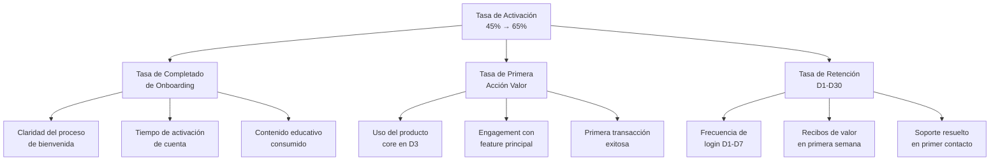
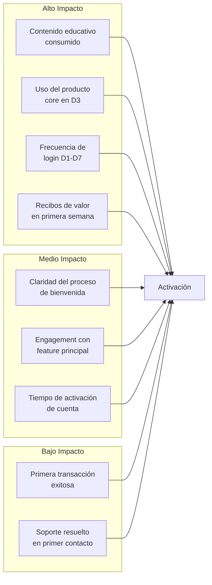

# Árbol de Métricas: Activación de Clientes Nuevos

## 1. Métrica Objetivo

**Tasa de Activación de Clientes Nuevos** = (Clientes que completan el onboarding en los primeros 30 días / Total de clientes nuevos registrados) × 100

**Meta actual**: 45% → **Meta objetivo**: 65% (+20 puntos porcentuales)

## 2. Descomposición del Árbol de Métricas

## 3. Palancas Acciónables por Métrica Derivada

### 3.1 Palancas de Tasa de Completado de Onboarding

| Palanca | Descripción | Mecanismo de Influencia | KPI Asociado |
|---------|-------------|------------------------|--------------|
| **Claridad del proceso de bienvenida** | Reducir la fricción cognitiva del cliente al entender qué debe hacer | Onboarding stepwise con progress bar visible, email de bienvenida con checklist claro | % de usuarios que completan el paso 1 en 24h |
| **Tiempo de activación de cuenta** | Eliminar barreras técnicas que retrasan el primer uso | SSO con redes sociales, verificación simplificada en un paso, onboarding < 3 minutos | Tiempo medio hasta primera acción |
| **Contenido educativo consumido** | Garantizar que el cliente entiende el valor del producto | Tutorial interactivo in-app, videos cortos (< 2 min), tooltips contextuales | % de usuarios que ven > 80% del contenido |

### 3.2 Palancas de Tasa de Primera Acción de Valor

| Palanca | Descripción | Mecanismo de Influencia | KPI Asociado |
|---------|-------------|------------------------|--------------|
| **Uso del producto core en D3** | Lograr que el cliente experimente el valor principal temprano | Setup guiado del feature principal, data inicial precargada, casos de uso sugeridos | % de usuarios con acción core en D3 |
| **Engagement con feature principal** | Incrementar la adopción del feature diferenciador | Highlight del feature en primer login, sample data personalizada, quick actions | NPS de descubrimiento de features |
| **Primera transacción exitosa** | Reducir la fricción en el flujo de compra/transacción | Checkout simplificado, payment methods precargados, garantía de primera compra | Tasa de conversión primer intento |

### 3.3 Palancas de Tasa de Retención D1-D30

| Palanca | Descripción | Mecanismo de Influencia | KPI Asociado |
|---------|-------------|------------------------|--------------|
| **Frecuencia de login D1-D7** | Crear hábito de uso en la primera semana | Notificaciones push personalizadas, reminder schedule, rewards por streak | D7 retention rate |
| **Recibos de valor en primera semana** | Demostrar ROI al cliente antes de que abandone | Dashboard de beneficios, weekly summary email, alertas de savings/ganancias | % de usuarios que reciben valor en D7 |
| **Soporte resuelto en primer contacto** | Eliminar frustraciones que causan abandono | FAQ contextual, chatbot con NLP, escalation en < 4 horas | FCR (First Contact Resolution) |

## 4. Matriz de Influencia entre Palancas

## 5. Hipótesis de Intervención

Para cada palanca, formulamos la hipótesis de que su mejora tendrá un impacto directo en la tasa de activación. Las hipótesis se priorizan en función del impacto potencial estimado y el esfuerzo de implementación, lo cual se desarrolla en el archivo de hipótesis.csv.

## 6. Definiciones Operativas

- **Onboarding**: Proceso desde el registro hasta que el usuario realiza su primera acción de valor.
- **Acción de valor**: Cualquier interacción del usuario que genera valor para él o para la empresa (primera compra, primer uso del feature core, primera publicación, etc.).
- **Cliente activado**: Cliente que ha completado onboarding Y ha realizado al menos una acción de valor en los primeros 30 días.
- **D1, D3, D7, D30**: Día 1, 3, 7 y 30 desde el registro.